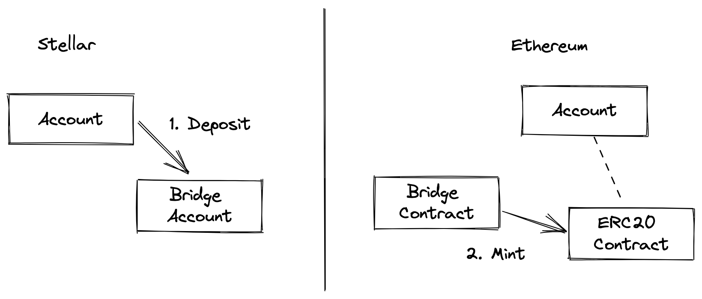
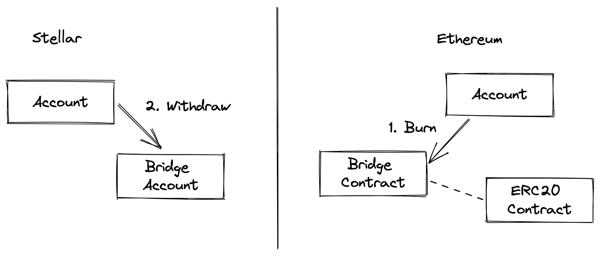
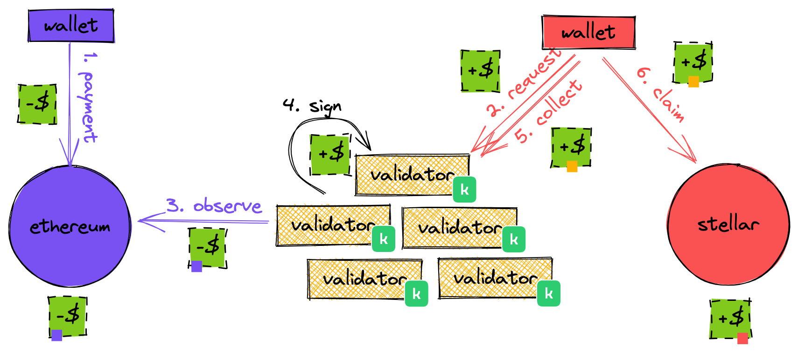
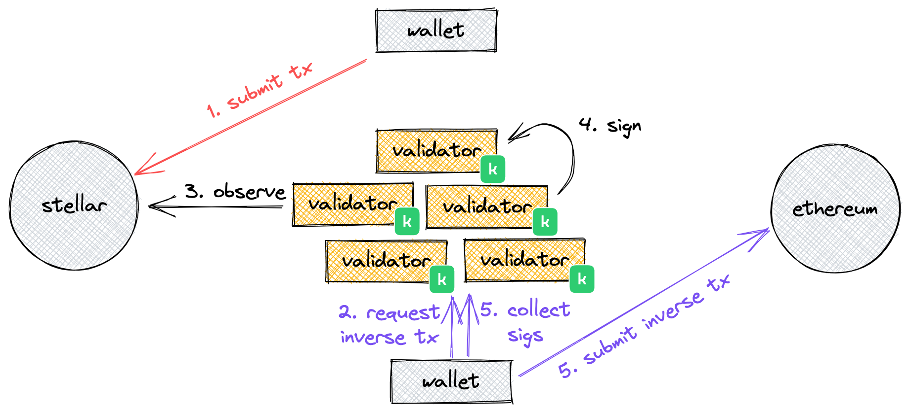
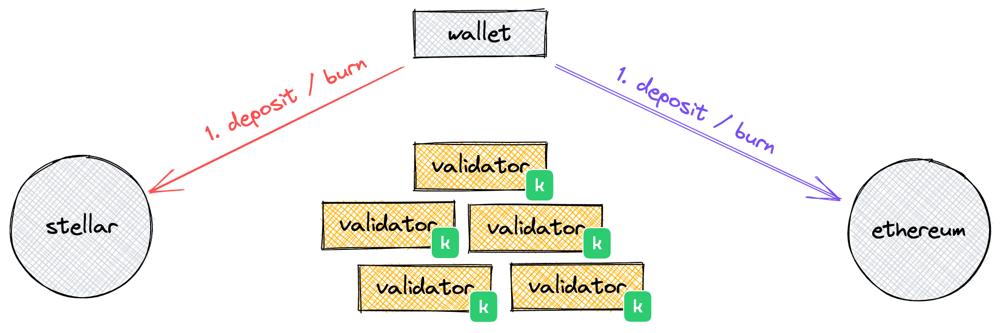
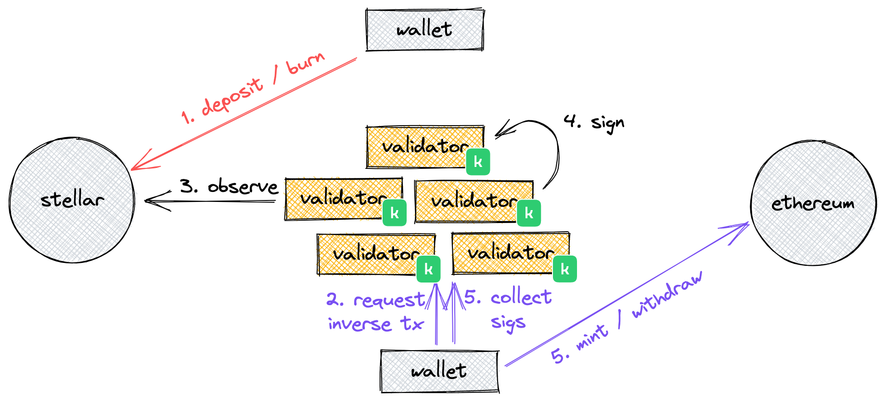
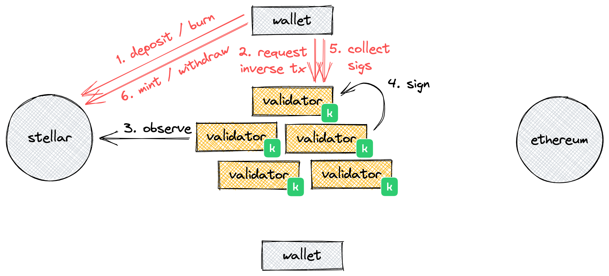

# Starbridge Design

## Local and Foreign Assets
Each chain has local and foreign assets. A local asset is an asset that exists originally on that chain. A foreign asset is an asset that has been transferred to the other chain and minted by the bridge on the other chain.

## Actions
The transfer of value is facilitated through four actions facilitating two different types of transfers:

### T1. Sending a local asset that may be used as a foreign asset

#### A1. Deposit
A deposit occurs when the sender participant delivers an asset local to the sending chain to an escrow account or smart contract on the sending chain. The asset is locked-up, escrowed, and unavailable for use while it is usable on the other chain.

#### A2. Mint
Minting occurs when the receiver participant collects an asset, on the receiving chain, that was local to the sending chain. A foreign asset is minted or issued and available for use on the receiving chain.

### T2. Returning a foreign asset that unlocks the local asset

#### A3. Burn

Burning occurs when the sender is transferring a foreign asset back to its origin chain. The asset is destroyed and evidence of the burn unlocks access to the local asset on the origin chain to the recipient of the transfer.

#### A4. Withdraw
A withdrawal occurs when the receiving participant collects an asset, on the receiving chain, that is local to the receiving chain.

## Validators
Validators observe state changes in both chains and produce signatures for messages that carry out the related inverse behavior that is expected on the other chain.

N validators are deployed and each hold one key for the m-of-n signer configuration. The signer configuration defines the control of the escrow account on Stellar and the control of withdrawals and minting in the smart contract.

Validators are passive and take no action without user interaction. They are not observing events in real time as they occur, but observe them when they need to. When a user requests a validator to help them to affect a transfer, the user provides the validator with a reference to a transaction on the source chain that contains the relevant information to be affected inversely on the other chain.

## Wallet Interactions
Wallets interact with the bridge to send and receive:

### Send
Wallets transfer the asset to the escrow account or contract including in the transaction or contract data information about the destination chain and destination address. Validators take no action as a result of this sent transfer by a wallet.

### Receive
Receivers ask the validators to produce a transaction or message native to the destination chain that the receiver can submit using their own details. In the case of Stellar this transaction is generated and submitted using their own sequence number.

The method by which the receiving wallet receives notification of the transfer and knows how to request the inverse tx is undefined.

When wallets request the inverse tx they are really requesting signatures for the inverse tx. After wallets request the inverse tx they see and collect signatures from as many validators as they can, even if the network only requires a message to be signed by a subset. This is so that changes in the account signers do not impact the wallet. If a validators signer is removed in an emergency or under a planned key rotation, the wallet will likely have signers from other validators that meet the threshold required to satisfy the multi-sig requirements.

Validators must protect against race conditions where-by both the receiver asks for two different inverse txs to be produced for the same transfer by ensuring that any signing for an observed event occurs serially for that event. It does not matter if different validators sign different inverse txs, following the above rules as long as none sign both, enough signatures will not be produced for both.

### Refunds / Reversals
It will be possible to support this by allowing validators to sign inverse messages on the source chain if the sender requests. This will be allowed as long as there is not a pending message that is still valid for the destination chain. Validators must protect against race conditions where-by both the original sender and the sender request an inverse tx at the same time.

### Replay Prevention
Messages produced by validators contain unique data from the sending chain to ensure that two messages are unique, even if they are between the same participants for the same amounts.

Messages accepted by the Ethereum contract are hashed and the hash of the message are stored on the chain when successfully processed. Messages are rejected if they are seen a second time.

Transactions generated for Stellar have replay prevention like all Stellar transactions, however due to the possibility that transactions fail during validation or apply which can require multiple transactions to be generated for a single transfer.

For both Ethereum and Stellar validators generate messages/transactions that are range bound to a set of ledgers, making it only valid for that set of ledgers. If the message/transaction is not seen successfully on the destination chain during those ledgers, the receiving wallet can ask for a replay and validators can generate a new message.

### Fees
Sender and receivers perform all on-chain transactions and pay the fees for their own transactions.

Validator fees are undefined.

### Governance
Validators coordinate manually outside of the bridge protocol to make non-transfer related changes to the network, signing messages for the Ethereum contract to modify the signing keys accepted, and signing transactions for the Stellar account to modify the signers configured.

The signing configuration and the changes possible are limited by the Stellar protocol’s multi-sig capabilities. Thresholds can be changed, and new signers can be added and removed. Any wallet that has requested a message with the old signer configuration signed may need to wait the timeout period for their transaction to expire and request a new message.
